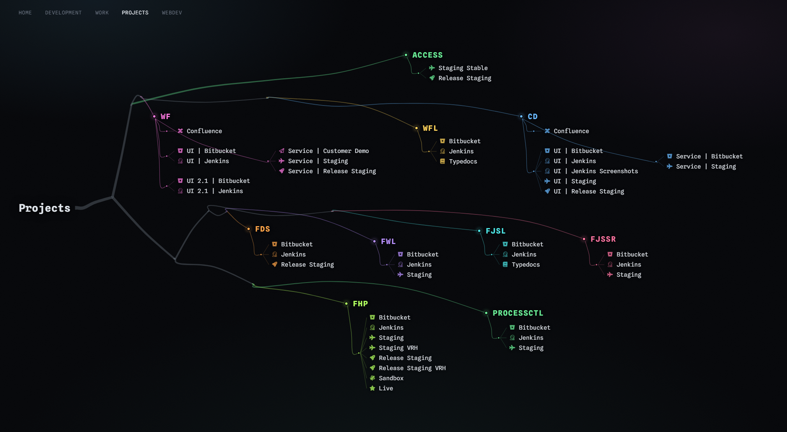
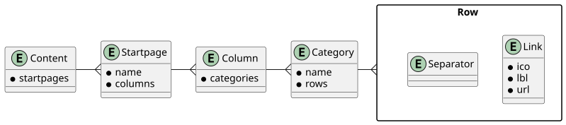

# Startpages



Start pages are designed to replace the default browser's new tab page. So
every time you open a new tab, one of your start pages will be displayed,
showing you a list of your favorite links and links to other startpages.

This is a template repository. You can create your own GitHub repository on
your own account using this template. Once created, you can edit the
configuration file (you can also use the GitHub web editor). For each link, you
can specify an icon and organize the links into categories and columns.

When you commit the changes, the already prepared GitHub action will parse your
configuration file and generate the GitHub pages, which you can then use to
override the browser's new tab location setting.

## Setting up the repository

First, create your own repository from this template repository. You can use
following
[guide](https://docs.github.com/en/repositories/creating-and-managing-repositories/creating-a-repository-from-a-template).

Next, activate the GitHub Pages in the settings:


## Defining the content

Content is defined in the `content/startpages.yaml` file with the following
schema:



By default, the icons come from [Font
Awesome](https://fontawesome.com/search?o=r&m=free&f=brands) and for easier
copy-paste it uses the whole snippet in the format:

```
<i class="fa-solid fa-magnifying-glass"></i>
```

You can easily copy the snippet by opening the icon popup window and clicking
on the code.

## The map

The page is not a layout, it is a drawing. The title sits on the left and the
tree grows rightward from it.

```
  root       the startpage itself
   └─ trunk  thick, and carrying nothing at all
       ├─ fork ─┬─ fork ─┬─ category ─ bud ─ leaf
       │        │        └─ category
       │        └─ fork ─┬─ category
       │                 └─ category
       └─ fork ─ ...
```

### Every joint is a fork of two

The skeleton is grown by halving: the categories a segment still has to reach
are split in two and handed to a fork, again and again, until a segment carries
one and arrives. So a joint is always a Y and never a run - a branch that sheds
one category and carries on gives a comb, which reads as a fern rather than a
tree.

The split is taken across whichever axis the remaining categories are more
spread over: up and down while a branch still serves several rows, left and
right once it is down to one.

**Width is depth.** The trunk leaves the title at 10px, every fork keeps two
thirds of its parent, down to a 1.5px tip. How far a piece of the skeleton is
from the root reads straight off it - which is also why the skeleton is drawn
as filled outlines rather than strokes, since a stroke cannot change width
along its length.

**Colour marks the group.** Trunk and forks are bark; the tip that has narrowed
to a single category takes that category's colour, along with its node, name,
stems, buds, veins and icons.

A limb on its way somewhere crosses whatever is in between, so a link is drawn
on a patch of background and the line passes behind it rather than through it.
It has to be a fill. A text-shadow halo is a blurred copy of the glyphs, so it
darkens only where there is ink and leaves every gap between the words open,
which is where most of a crossing line shows: measured on one label, a halo hid
11% of the line and the patch hid two thirds. The patch is radial rather than
flat, because a rectangle of background over a background is still a rectangle -
it covers the ambient gradients that light everything around it, and a hard
edge reads as a panel. Faded out by its own corners it does not read as
anything.

The tones are set for a screen read in daylight, not only at a desk. Ambient
light reflecting off the panel adds a luminance floor to foreground and
background alike, so a nominal contrast of 15:1 can land nearer 4:1 outdoors and
anything already dim disappears. What that costs is colour: equalising every
tone against a glare floor turns them all into pale pastels, and the colours are
what you navigate by. So only the genuinely dark tones are lifted, and only far
enough to clear the rest of the family - which keeps the closest pair of tones
apart while raising the dimmest from 8:1 to 10.5:1. The rest of the margin comes
from weight and from the alpha on the vector work, neither of which costs any
hue at all.

### The crown

The categories are laid out in rows, and the rows are not the same length: each
aims at a share of the content proportional to how wide an ellipse is at that
height, so the middle rows are long and the top and bottom ones short. Centring
them rounds the crown off at both ends - and leaves the room on the left that
the branches need to fan out through.

Every other category on a row is dropped below its neighbours. A row all at one
height gives the branch above it nothing to fork into, and whatever the skeleton
does up there collapses into a flat bus with ticks hanging off it; the stagger
is what lets a fork be a Y.

A run of more than eight links with no separator in it makes a fan tall enough
to set the height of its whole row, which forces the crown wider or taller than
it needs to be. Long runs are halved so the packer can put them side by side
rather than end to end.

How many rows there are comes from a search over every row count up to four,
against a grid of clearances, keeping the largest crown that still fits. The cap
matters: beyond four the crown grows taller than the title it hangs off, and
since the title is pinned the trunk turns into a long vertical spine up the
left-hand side.

The densest map needs more area than a screen has, so the only question is where
the overflow goes. Overshooting the width is weighted heavier than overshooting
the height - too tall is a mouse wheel, too wide is a horizontal pan, and
panning is the worse of the two.

### Getting past things

A crown puts branches across clusters, so a segment has to find its way past
them. Two things about how turned out to matter more than they sound.

**Displace waypoints, not samples.** Pushing every sample that lands inside a
cluster out to the clearance line squares the detour off - a flat plateau with
a corner at each end - and spreading that push into neighbouring samples only
trades square shoulders for spikes, because the tents around adjacent clusters
pile up. What a segment needs is a handful of deliberate waypoints: the
clusters the straight line crosses are found, merged into runs, and each run
gets one apex to arc over. Few points in, smooth curve out.

**Commit to one direction.** Escaping to whichever side happens to be nearer
makes a branch zigzag around one cluster and back around the next; going the
way the segment was already travelling turns the same dodge into a single arc.

A long clear stretch between two waypoints then gets a little belly, so it does
not come out ruler-straight.

Each segment is its own filled outline, so where a parent ends and two children
begin, three square ends meet at an angle and leave a notch. A child is backed
up slightly into its parent and given a first waypoint along the direction the
parent arrived on, which fills the notch and leaves the joint on the same
tangent - but only when it is genuinely carrying on that way. Backing a sharply
turning child into its parent makes the path double back, and a curve through a
reversal ties a knot.

Once a branch is down to categories on a single row, its forks move up into the
clear lane above that row. A fork has to sit behind everything it feeds, so a
fork left of the row means the twig to the far end has to cross every cluster in
between; up in the lane it travels over open ground and drops onto each node.

The map is anchored top-left and never centred, and the field is a fixed height
whatever a particular map needs, so the strip of maps and the title land on the
same pixel on every page - `48,24` and `48,534`.

Every map is listed in that strip on every page, including the one you are
looking at, which is marked rather than left out. Omitting it would shift all
the names after it along, so the strip would move as you moved between maps.

### The field behind it

The tree leaves a lot of dark. What fills it is not decoration laid over the
page but the same shape read again: the **distance to the nearest content** is a
scalar field over the canvas, and the strings are its contour lines. So they
cannot help but follow the crown - they are what "everything 120px out from the
tree" looks like.

**It is traced over a bleed, not over the map.** The map is only as big as its
content, so on a sparse page it stops well short of the screen - webdev is
1198px of map on a 2000px display, and everything right of that was dead space
the tracer never looked at. The field is traced over a region generously larger
than the map instead. It paints out there because the SVG is absolutely
positioned with `overflow: visible`, and shapes outside an SVG's box are drawn
without joining the scrollable area, since they are not CSS boxes - so the
background reaches the edge of a wide display without the page gaining a
scrollbar.

What it cannot escape is the scroll container. `.viewport` is `overflow: auto`,
which clips to that element's own box, and the box is only as tall as the map.
Sideways this never showed, because the viewport is already the full width of
the page; downwards it cut the field off at the last row of the tree - 569px of
traced field on the shorter maps - and left a bare band under it on any window
taller than the map. A `min-height` of one screenful is what stretches the clip
to the bottom of the window.

Each contour is traced by predictor-corrector: step across the gradient, then
correct back onto the level. Seeds are scattered on a grid, kept apart so two
traces do not walk the same line, and capped per level - though the cap has to
be loose enough that the scan does not spend its whole budget on the first side
it reaches, and the far side stays bare.

**The distance is blended, not a plain minimum.** Where two clusters are equally
close, the minimum of their distances has a crease running between them, and a
contour crossing that crease comes out with a sharp corner - or, where the
corrector oscillates across it, a little tangle of spikes. Rounding the join by
a blend radius removes the crease, and every contour is smooth wherever it runs.

**The gaps widen sharply with distance.** Out past the crown the field is smooth
and monotonic, so evenly spaced levels lay down a comb of parallel lines at a
constant gap, which reads as hatching rather than weather - and since the far
field is the largest area on the page, a constant gap puts the most ink where
there is least to say. The spacing grows by a cubic: negligible across the first
few levels, which are the ones that trace the crown, and dominant by the last.

Two kinds of debris have to go: traces that die a few steps after starting, and
traces that curl up in a pocket between the title and the trunk and come out
long but tiny. Length catches the first. The second needs *reach* - the extent
of the trace's bounding box - because a curl covers little ground while
travelling far. Neither can be caught by how far apart the ends are: a contour
that legitimately wraps half the crown also comes back on itself.

Colour is a quarter of the nearest category's tone folded into a neutral grey -
far too little to name, enough that the field belongs to the tree. Opacity falls
off with distance, so the near strings sit just above the background and the far
ones barely register.

This is the one thing on the page that moves. The strings are dealt into four
groups that breathe on a long cycle, each group started at its own point in it,
and three strings carry a ripple: a short dash travelling the length on a slow
loop. Both are CSS on paths that already exist, so nothing is computed at
runtime. Under `prefers-reduced-motion` the breathing stops and the ripples are
removed outright.

**The animation belongs on the groups, not on the strings.** Declared per string
it is one animating element per line - up to a hundred of them, each with a
bounding box the size of the field - and `will-change: opacity` on each asks the
browser to promote every one to its own compositor layer. That came to 314-461MB
of layer memory per page, far past what a laptop will hold, and a browser that
cannot keep its tiles drops them and rasterises again: on screen, whole regions
of the page blinking out. Sharing one animation between four groups and dropping
`will-change` takes it to no promoted layers at all and a sixth of the repaint
area, with nothing to see in the result. One ripple per four strings was a
rhythm rather than an event, and on a wide page it was twenty at once; three is
the whole point of the word occasional.

### How much is computed

All of it, at build time, in `src/main.rs`: every label measured, every
category split into groups and packed into fans, every block placed, every limb
routed, every curve sampled and given width.

This works because **the type is monospaced**: a label is exactly
`characters x advance` wide, so the generator knows where every word will land
without rendering anything. The geometry constants in `src/main.rs` and the
font sizes in `sass/styles.scss` are therefore two halves of one contract.
Change a font size on one side without the other and the veins stop meeting the
words.

### Why not d3

d3-hierarchy would give `tree()` and `cluster()` and their radial variants. The
layout here needs none of them - leftmost-fit packing, shape-driven fan
splitting and obstacle routing are a custom pass whichever library is
underneath. What d3 would add is a CDN dependency, a layout pass on every new
tab, a frame of reflow before the page settles, and link positions that only
exist after JavaScript has run, which is exactly when Vimium wants to hint
them.

The useful half of d3 is the mathematics, and that runs perfectly well in Rust
at build time. So the page ships as static HTML with an SVG in it: no script,
no library, no layout pass, nothing to wait for.

Nor is there reason to leave HTML for canvas or WebGL. The medium was never the
limit - leaving the layout to CSS was. Every link is an ordinary `<a>` at a
computed coordinate, so `f` hints it, middle-click opens it in a tab and the
text can be selected. A canvas would lose all three.

Type is [Spline Sans Mono](https://fonts.google.com/specimen/Spline+Sans+Mono),
loaded from Google Fonts in `templates/startpage.html`. Nothing moves except the
background field, and that stops for `prefers-reduced-motion`.

The canvas has computed dimensions, so a window smaller than the map pans
rather than reflowing - down to 900px, below which it stops being a map at all.

### On a phone

There is no arrangement of a fixed-coordinate drawing that reads on a phone, so
below 900px the whole conceit is dropped and the page falls back to the plain
column it would have been without any of it: the wiring is hidden, the absolute
positioning is switched off, and the links become 44px rows.

Nothing has to be reordered to do that, because document order already is the
column - the title, then the strip of maps, then each category name immediately
followed by its own links. The structure the wiring carried is carried by
sequence instead, and the one thing that is kept is the colour per category,
which is what the tree was using to say where you are anyway.

The strip of maps is the only part that has to become a row rather than a
column, so it is wrapped in a `nav` that is `display: contents` everywhere else
- generating no box, it leaves the links inside it positioned against the map
exactly as before.

## Settings

The gear in the top-right corner opens a small settings dialog. Both choices
are remembered per browser (`localStorage`), so every startpage on the same
site follows them.

**Layout** is one of three:

- **Map** - the drawing described above.
- **Columns** - the same content and colours, flowed into as many columns as
  the window holds. Below 900px wide the map always falls back to this.
- **Classic** - the page as it was before the map: the `columns` exactly as
  `content/startpages.yaml` arranges them, in a base16 colour scheme.
- **Triptych** (experimental) - classic, in five columns of 12% 18% 40% 18%
  12%. The middle is this page; either side of it are the previous and next
  page in small type, and beyond those the pages two away in smaller type
  still, each with its name as a link to it. Below 1400px wide the outer two
  go and it is 25% 50% 25%. All of them ignore the configured `columns`:
  categories fill a grid left to right, with as many per row as fit at a
  minimum width (210px in the middle, 165px either side of it). The pages at
  the edges are always a single column. The pages form a ring, so the first
  page's previous is the last and the last page's next is the first. Below
  900px wide only the middle is shown.

**Theme** picks the colour scheme of the classic and triptych layouts. Every file in
`sass/colorschemes/` is offered; the generator writes them all to
`css/themes.css` as `--base00`..`--base0F` under a `data-theme` attribute, so
switching is instant and needs no rebuild. To add one, drop another base16
`.scss` file in that directory. The default is Gruvbox dark, hard.

## Changing startpage template

Startpage template is in `templates/startpage.html`, and it will be processed by
[Tera](https://tera.netlify.app/) template engine.

## Public directory

All content of `public/` will be copied to generated site. You can use this
directory to store images, or JavaScript files which you can reference in your
modified startpage template.

## Generating site locally

Install [Rust and Cargo](https://www.rust-lang.org/tools/install).

Then you can run the generator in watch mode, so every time you update a file
the generator will regenerate the `_site/`.

```
cargo install cargo-watch
cargo watch -x run
```

## Merging changes in template

Once the new repository is created from this template, it starts with a clean
slate and does not include the history of the template. Therefore, Git will not
allow a simple merge. You will need to use the `--allow-unrelated-histories`
flag.

## Contributing

The repository that you generate will not share history with this template
repository. If you want to contribute you will need to fork the template repo
conventional way.

For feature requests, questions and new ideas please use
[Discussions](https://github.com/PrimaMateria/startpages-template/discussions)
and [Issues](https://github.com/PrimaMateria/startpages-template/issues) use
for reporting bugs.
